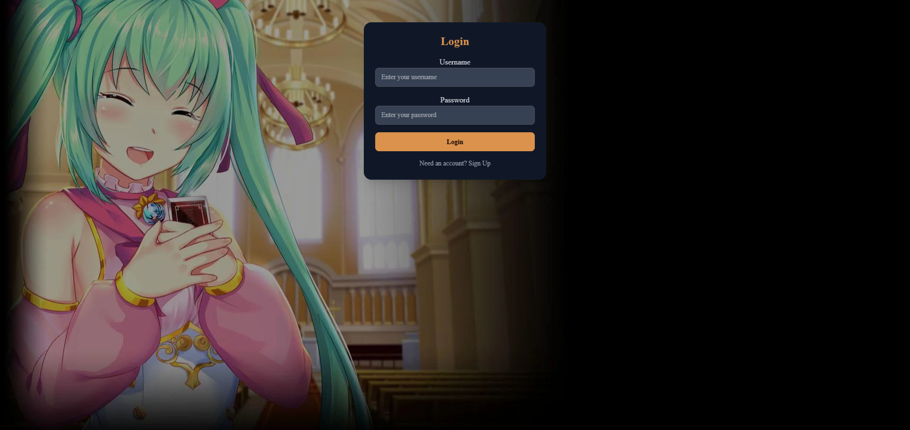
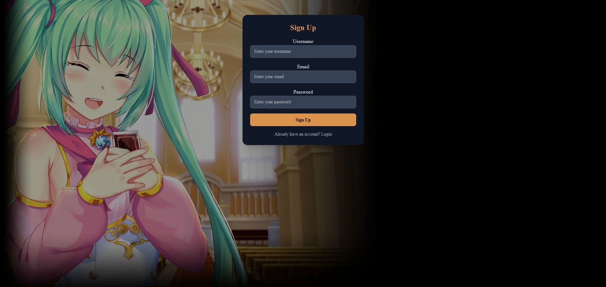
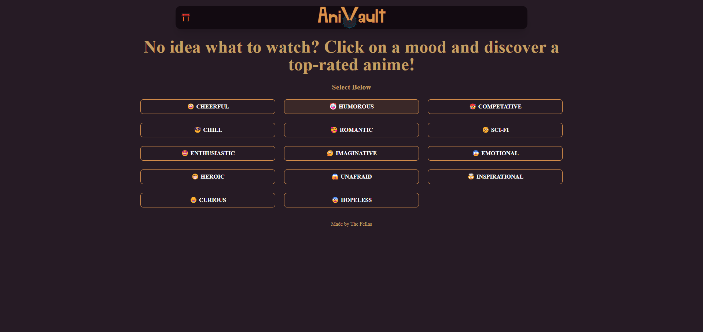
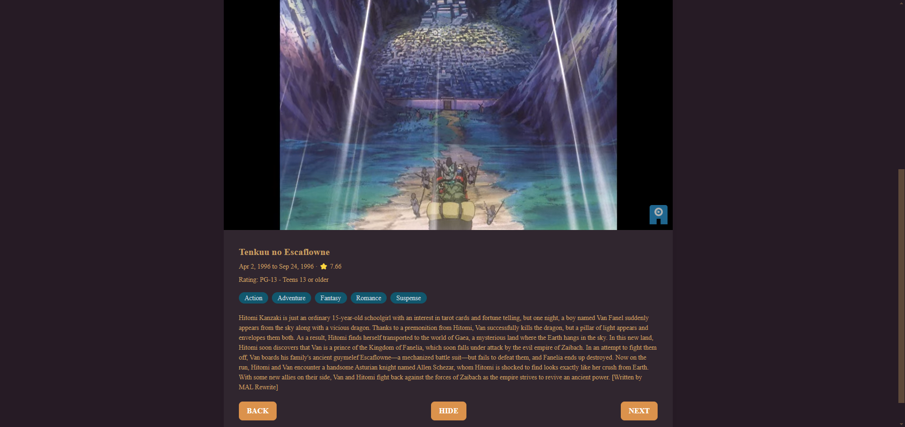

# AniVault
https://anivault.onrender.com/

# <Your-Project-Title> 

## Questions 

Adam: https://github.com/akovaly

Greg: https://github.com/CodeGA366

Mark: https://github.com/MarkSian

Zach: https://github.com/ZadeHart

https://github.com/MarkSian/AniVault

## Description

The world of anime is quite vast. There is a plethora of genres from adventure and comedy to horror and romance. It can be a bit intimidating and difficult to find what's right for you. That's where AniVault comes in. Whether you're a veteran otaku or a newbie weeb this application makes it easy to find animes that are new and exciting, or perhaps old and nostalgic animes that have slipped from your memory. Choose your desired genre and let AniVault generate random animes for you to pick from. You can skip to the next anime, hide them so that AniVault won't show them to you again, or go back just in case you want to give a suggestion another look. With AniVault you'll have access to a massive collection of amazing animes. So start searching and get to bingeing.

## Table of Contents

- [Questions](#questions)
- [Description](#description)
- [Installation](#installation)
- [Usage](#usage)
- [Credits](#credits)
- [Features](#features)
- [License](#license)

## Installation

npm install, npm run build, npm run start

## Usage

As a user I can use AniVault to search for animes. Upon opening the application I am presented with a login/sign up page.

Once I login or sign up I am presented with the home page and a variety of buttons that allow me to choose from several different genres.

If I click on one of the genre buttons I am presented with details of a random anime. I can see the title, air date, star rating, rating, all of the genres it falls under, and a description. I am also given a NEXT button to go to the next anime, a HIDE button to hide the current anime so that it won't be shown again, and a BACK button to go to the previous anime.

## Credits

Adam Kovaly

Mark Sianipar

Gregory Armstrong

Zachary A. De Hart

AKA The Fellas

## License

MIT
